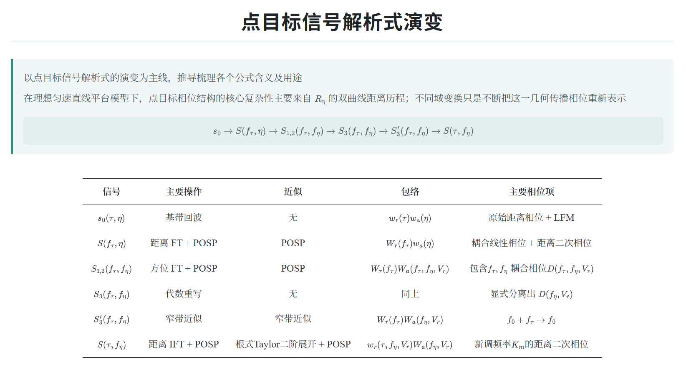
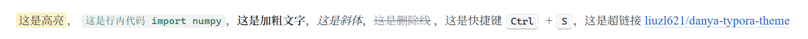
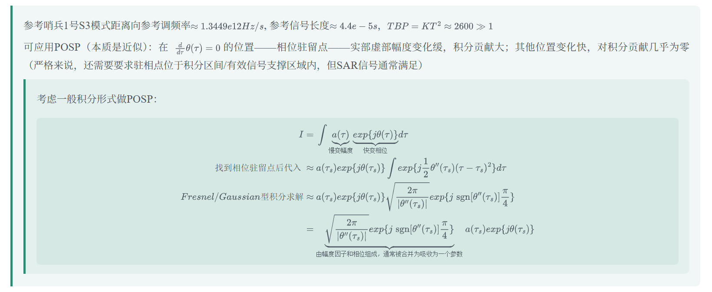
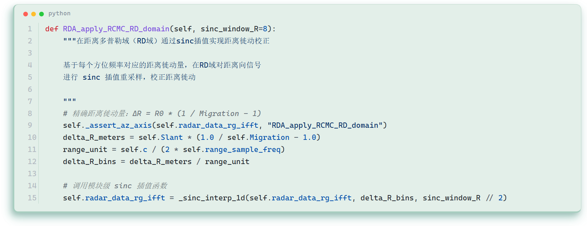
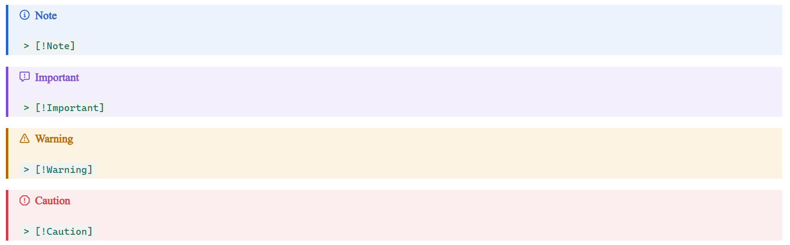

# danya（淡雅）

A calm, low-saturation teal theme for Typora.

一个 Typora 主题：

- 低饱和青绿强调色，不花哨；标题黑体，正文宋体，西文与数字 Times new Roman

- 表格渲染为居中三线表

- 正文行内元素预览

- 嵌套引用逐级加深

- 代码块主题色底色

- GitHub  ⻛格提⽰栏（ Typora ≥ 1.8 ，需在  偏好设置 → Markdown →  勾选「 GitHub Style Alert 」）：

## 安装

1. Typora → 偏好设置 → 外观 → 打开主题文件夹；
2. 拷入 `danya.css`、`danya.user.css` 和 `danya/` 整个目录；
3. 重启 Typora，在「主题」里选 **danya** 。

个别 Typora 版本对 `@import` 支持不好时，跑 `python scripts/build.py`，改用 `dist/` 里的单文件版。

## 自定义

配色、字体、字号、间距全部集中在 `danya/variables.css`，改完保存、回 Typora 重点一下当前主题即生效。非必需，用于个人微调。

## 许可

MIT，见 [LICENSE](LICENSE)。主题只引用系统已装字体名、不打包字体文件；字体遵循各自授权。
